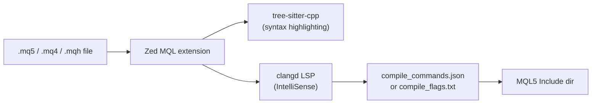

# zed-mql

> MQL4/MQL5 language support for [Zed](https://zed.dev) with **clangd** IntelliSense.

Brings MQL (MetaQuotes Language) — used for MetaTrader 4 and MetaTrader 5 Expert Advisors, indicators, and scripts — into Zed with first-class editor support.

## Features

| Feature | Status |
|---|---|
| Syntax highlighting (`.mq4`, `.mq5`, `.mqh`) | ✅ |
| Code completion (via clangd) | ✅ |
| Go to definition / Find references | ✅ |
| Hover documentation | ✅ |
| Diagnostics in the Problems panel | ✅ |
| Document outline (functions, classes, enums) | ✅ |
| Works with existing `compile_commands.json` | ✅ |
| MQL4 + MQL5 mixed workspaces | ✅ |
| macOS / Linux (Wine) | ✅ |

## Requirements

- **Zed** 0.140+ (extension API schema v1)
- **clangd** ≥ 16 on your `PATH`
  - macOS: `brew install llvm` then add `/opt/homebrew/opt/llvm/bin` to `PATH`
  - Ubuntu/Debian: `sudo apt install clangd`
  - Arch: `sudo pacman -S clang`

## Installation (dev / local)

Until this extension is published to the Zed extension registry, install it from source:

```bash
# Clone this repo or copy the zed-mql directory somewhere
cd /path/to/zed-mql

# Install as a dev extension in Zed:
# Zed → Extensions → Install Dev Extension → select this folder
```

Or via Zed's command palette:
1. `cmd+shift+p` → **zed: install dev extension**
2. Select the `zed-mql` directory

## Setup

### Option A — Use an existing `compile_commands.json` (recommended)

If you already have the **MQL Clangd** VS Code extension set up, it generates a
`compile_commands.json` in your workspace root.  Zed's clangd instance will pick
it up automatically — **no further configuration needed**.

### Option B — Manual `compile_flags.txt`

Create a `compile_flags.txt` in your workspace root:

```
-xc++
-std=c++17
-D__MQL__
-D__MQL5__
-fms-extensions
-fms-compatibility
-ferror-limit=0
-Wno-everything
-I/path/to/MetaTrader5/MQL5/Include
-I.
```

Adjust the `-I` path to your MetaTrader 5 installation's `Include` directory.

### Option C — macOS with Wine (MetaTrader under Wine)

The `Include` directory typically lives at:

```
~/Library/Application Support/net.metaquotes.wine.metatrader5/drive_c/Program Files/MetaTrader 5/MQL5/Include
```

Add that to `compile_flags.txt` with an `-I` flag.

## Suppressing clangd false-positives

MQL is not standard C++. Create a `.clangd` file at the workspace root to suppress
known false-positive diagnostics:

```yaml
CompileFlags:
  Add:
    - -Wno-everything

Diagnostics:
  Suppress:
    - pp_file_not_found
    - unknown_typename
    - undeclared_var_use
    - redefinition
    - ovl_no_viable_function_in_call

  ClangTidy:
    Remove:
      - modernize-*
      - cppcoreguidelines-*
      - readability-identifier-naming
```

> **Tip**: The MQL Clangd VS Code extension generates a comprehensive `.clangd`
> with ~100 suppressed diagnostics. If you have that file already, reuse it.

## How it works



The extension:
1. Registers `.mq4`, `.mq5`, and `.mqh` file types as the **MQL** language.
2. Uses **tree-sitter-cpp** for fast, accurate syntax highlighting (MQL is a
   C++ superset, so the grammar parses it cleanly).
3. Launches a **clangd** instance for semantic features. If a
   `compile_commands.json` exists in the workspace (e.g. generated by the MQL
   Clangd VS Code extension), clangd uses it directly for maximum accuracy.
   Otherwise, MQL-specific fallback flags are passed via initialization options.

## Differences from VS Code MQL Clangd

| Feature | zed-mql | VS Code MQL Clangd |
|---|---|---|
| Syntax highlighting | ✅ | ✅ |
| IntelliSense (clangd) | ✅ | ✅ |
| Go to definition | ✅ | ✅ |
| Compile from editor | ❌ | ✅ |
| Auto-generate compile_commands.json | ❌ | ✅ |
| Live Runtime Log | ❌ | ✅ |
| Trade Report Dashboard | ❌ | ✅ |
| Backtest runner | ❌ | ✅ |
| MQL Debugger | ❌ | ✅ |

> For compile/debug/backtest workflows, use the VS Code MQL Clangd extension.
> Use **zed-mql** when you want to edit MQL in Zed with full IntelliSense.

## Contributing

PRs welcome. The two most impactful improvements would be:

1. **A dedicated tree-sitter-mql grammar** — currently we reuse tree-sitter-cpp,
   which parses MQL correctly but doesn't know MQL-specific directives like
   `#property` and `#import`.
2. **Compile integration** — a task provider that calls MetaEditor's CLI.

## License

MIT
